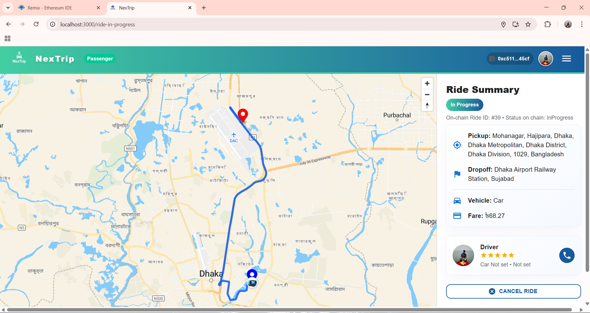
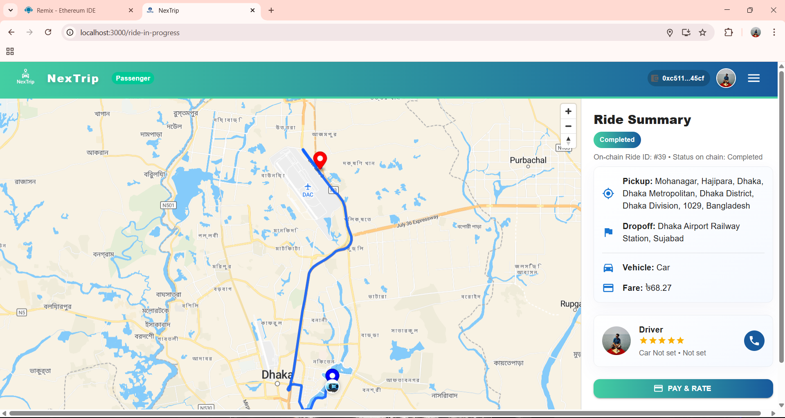

# NexTrip – Decentralized & Privacy-Preserving Ride-Sharing System  
*A Permissioned Ethereum + IPFS Powered Mobility Platform*

---

## ⭐ Overview  
NexTrip is a decentralized ride-sharing platform designed to ensure **privacy**, **security**, and **transparency** using:

- **Permissioned Ethereum Geth Blockchain**  
- **Solidity Smart Contracts**  
- **IPFS distributed storage**  
- **React + Node.js full-stack implementation**  
- **MetaMask authentication & transaction signing**

This project was developed as part of the **B.Sc. Engineering Thesis** at **Ahsanullah University of Science and Technology (AUST)**.

---

## 🚀 Key Features  
- 🔐 Private Ethereum blockchain for secure user & ride data  
- 📝 Smart contracts for user registration, ride booking, payment  
- 📦 IPFS for decentralized off-chain storage  
- 💳 MetaMask wallet connectivity  
- 🧭 Real-time ride tracking workflow  
- 📱 Modern UI (React + Material UI)  
- 📊 Performance evaluation (TPS, gas usage, latency)

---

---

# 📸 Screenshots  

## 🌐 User Interface

### **Landing Page**

### **Login**

### **User Registration**

### **Driver Registration**

### **Ride Request**

### **Ride In Progress**

### **Ride Completed**

### **Driver Dashboard**

### **Ride History**

### **Admin Dashboard**

---

## 🔗 Blockchain & IPFS

### **System Architecture Diagram**

### **Bootnode Running**

### **Connected Nodes**

### **Geth Log Output**

### **Deployed Smart Contract**

### **MetaMask Connect**

### **MetaMask Transaction**

### **IPFS File Upload Placeholder**

---

# 🧩 System Architecture  
NexTrip is designed using a **hybrid on-chain + off-chain model**:

- **On-chain (Ethereum Geth)**  
  Smart contracts handle user identity, ride states, payments, ratings  

- **Off-chain (IPFS)**  
  Stores documents, logs, and ride-related metadata  

- **Backend (Node.js)**  
  IPFS interactions, hashing, CID generation, metadata processing  

- **Frontend (React)**  
  User dashboard, booking interface, driver panel, admin panel  

---

# 🧪 Performance Evaluation  
NexTrip was tested for:

- ⏱️ Latency under concurrent requests  
- ⚡ Transactions per second (TPS)  
- ⛽ Gas consumption for ride functions  
- 🖥️ Node CPU/RAM usage  
- 📦 IPFS upload & pinning performance  

Full experimental results are available in the thesis report.

---

# 🧑‍💻 Authors  
- **Mostafizur Rahman Fahim**  
- **Sk. Md. Shadman Ifaz**  
- **Rayhan Ferdous Srejon**

🎓 **Supervisor:**  
**Mr. Md. Khairul Hasan**  
Associate Professor, CSE, AUST

---

# 📜 License  
This project is developed for academic research and educational use.  
Feel free to fork, modify, or cite with credit.

---

# 🙏 Acknowledgements  
- Almighty Allah  
- Faculty Members & Supervisor  
- Our Parents  
- Everyone who supported the research  

## 🎥 Demo Video
Watch the full system walk-through video here:  
🔗 https://drive.google.com/file/d/1RJ74MUg7t770ObmyK_L1EodLKGa3DaoE/view?usp=sharing

