# **NexTrip – Decentralized & Privacy-Preserving Ride-Sharing System**

*A Permissioned Ethereum + IPFS Powered Mobility Platform*

---

## ⭐ Overview

NexTrip is a decentralized ride-sharing system built using a **permissioned Ethereum Geth blockchain**, **smart contracts**, and **IPFS distributed storage**.
It ensures **privacy**, **transparency**, **tamper-proof ride records**, and **fair interactions** between drivers and passengers—without relying on centralized platforms.

This project was developed as part of the **B.Sc. Engineering Thesis** at **Ahsanullah University of Science and Technology (AUST)**.

---

## 🚀 Key Features

### 🔐 **Permissioned Ethereum Blockchain (Geth)**

* Stores user identity, ride data, and payment events immutably
* Controlled network participation (PoA – Clique)

### 📦 **Decentralized Storage with IPFS**

* Stores large files (documents, logs, ride meta) efficiently
* Blockchain stores only CIDs for tamper-proof reference

### 📝 **Smart Contract Automation**

* User registration
* Ride creation, matching, booking
* Payment settlement
* Ride completion & cancellation
* User rating system

### 🧭 **Ride Coordination Workflow**

* Passenger requests ride
* Drivers receive/accept requests
* Real-time ride progress
* On-chain transaction-based payment

### 🛡️ **MetaMask Integration**

* User authentication
* Secure transaction signing

### 🖥️ **Modern Full-Stack Implementation**

* **React.js + Material UI** for the frontend
* **Node.js + Express.js** backend services
* **Ethers.js** blockchain interaction

---

## 📁 Project Structure

```
NexTrip/
│
├── backend/
│   ├── server.js
│   ├── routes/
│   ├── utils/
│   └── ipfs/
│
├── blockchain/
│   ├── genesis.json
│   ├── node1/
│   ├── node2/
│   └── contracts/
│       ├── UserManagement.sol
│       ├── RideSharing.sol
│       └── Utility.sol
│
├── frontend/
│   ├── src/
│   ├── public/
│   └── package.json
│
├── screenshots/
│   └── *.png (UI images)
│
└── README.md
```

---

## 🛠️ Technologies Used

### **Blockchain**

* Ethereum Geth (Permissioned Network)
* Clique (PoA) Consensus
* Solidity Smart Contracts
* MetaMask Wallet
* Ethers.js

### **Off-Chain**

* IPFS (Distributed File Storage)
* Node.js / Express.js

### **Frontend**

* React.js
* Material-UI (MUI)
* Web3 / Ethers

---

## ⚙️ System Architecture

Below is the high-level architecture including blockchain, IPFS, backend, and UI layers.

*(You can include your Figure images here if needed using screenshots folder)*

Example:

```
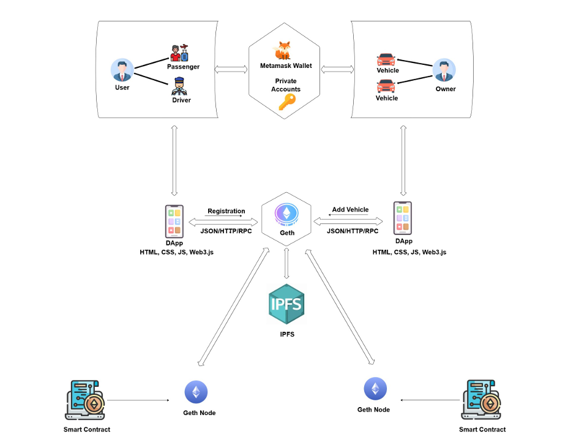
```

---

# 📸 Screenshots  

### **Landing Page**
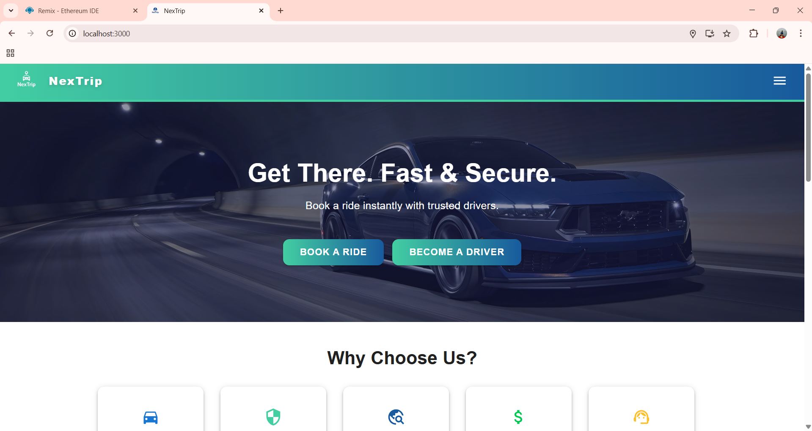

### **Login**
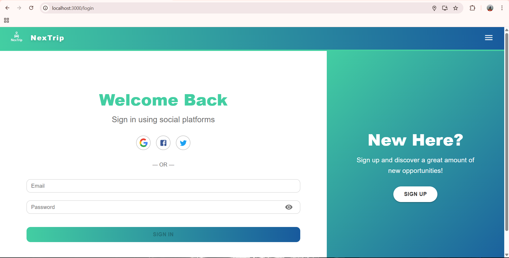

### **User Registration**
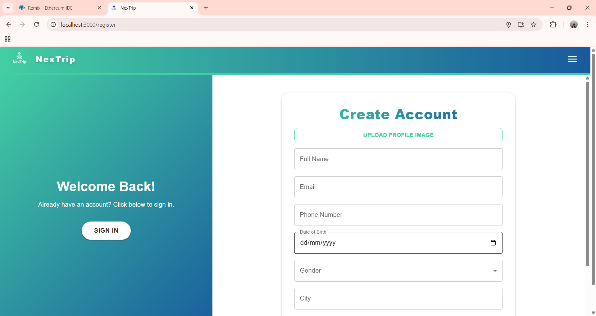

### **Driver Registration**
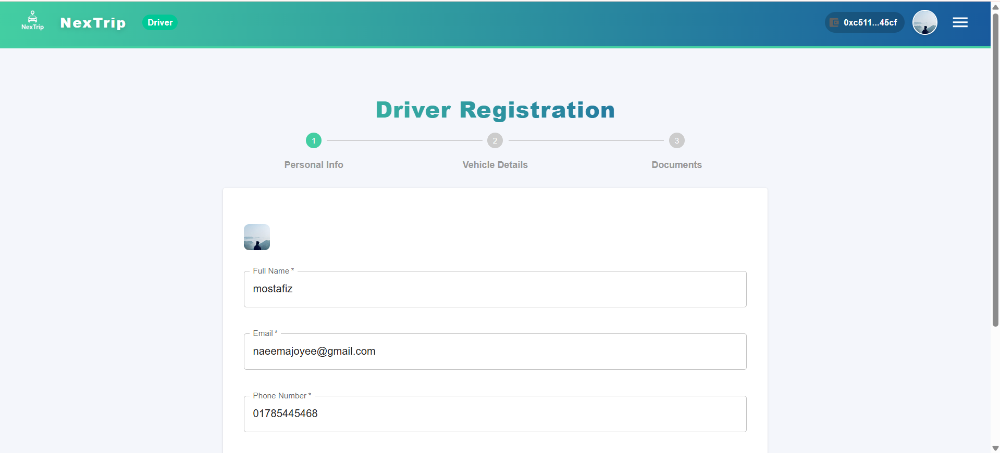

### **Ride Request Page**
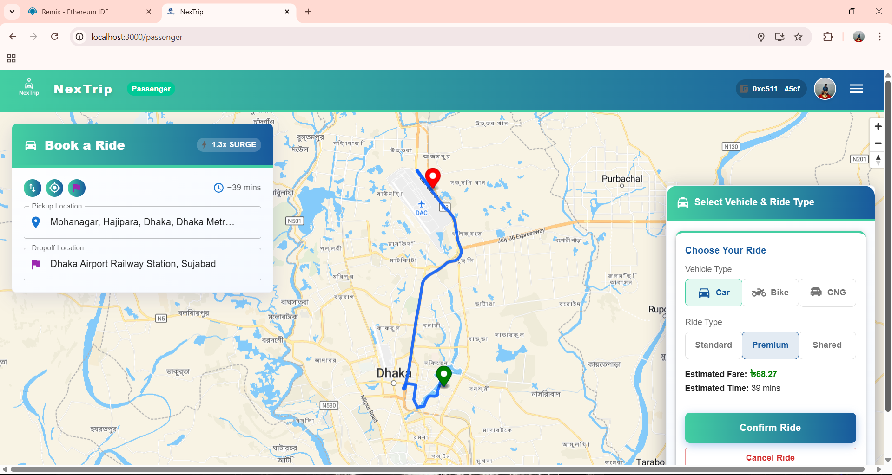

### **Ride In Process**


### **Driver Dashboard**
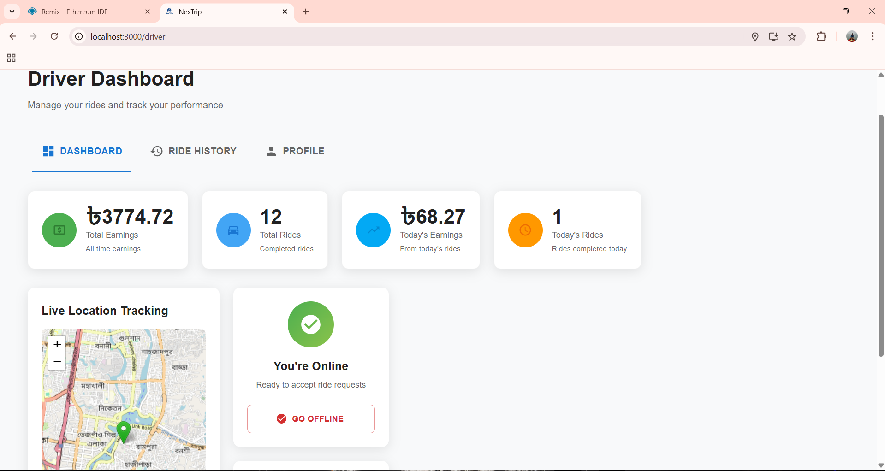

### **Ride History**
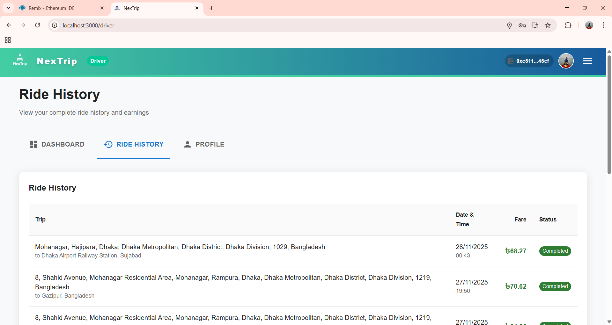

### **Admin Dashboard**


---

# 🔗 Blockchain & IPFS Screens  

### **Bootnode Running**
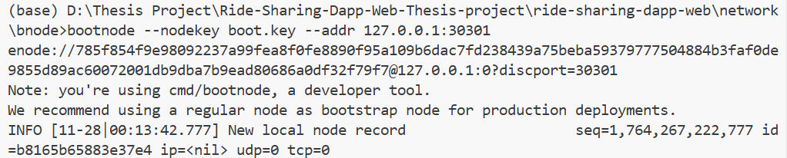

### **Connected Geth Nodes**
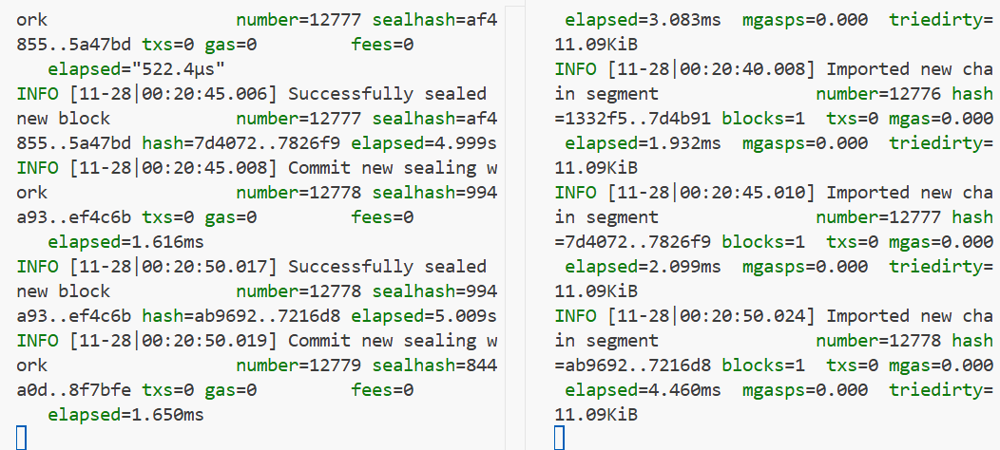

### **Geth Log**
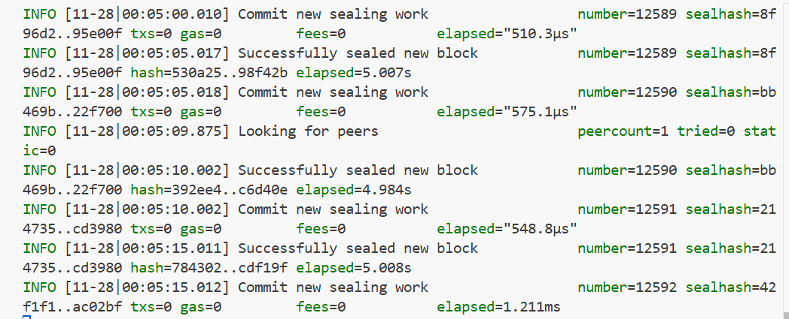

### **Deployed Smart Contract**
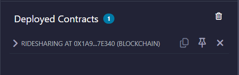

### **MetaMask Connect**
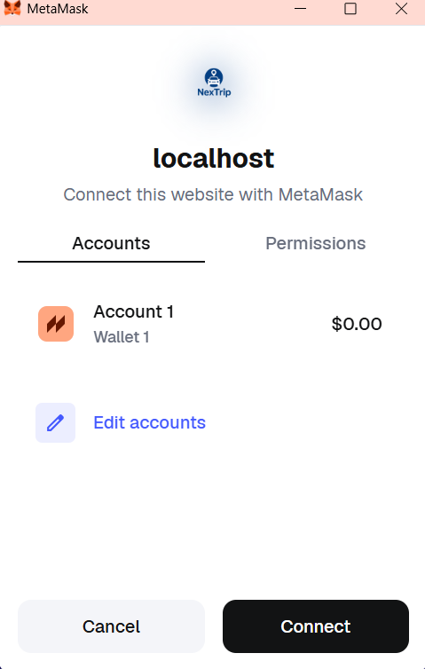

### **MetaMask Transaction Confirmation**
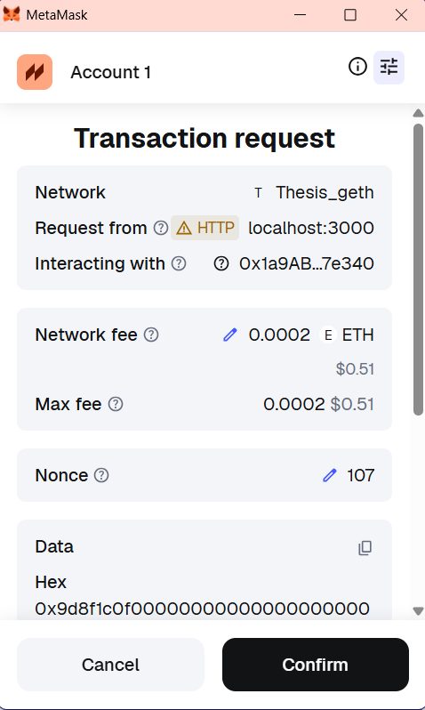

### **IPFS Upload Placeholder**

---

## 🧪 Experiments & Evaluation

The system was tested using:

* Geth diagnostic tools
* Workload generator scripts
* IPFS CLI diagnostics
* Blockchain performance benchmarks

### 📊 Performance Metrics

* **Latency vs Concurrent Requests**
* **Transactions Per Second (TPS)**
* **Gas Consumption (Ride creation & payment)**
* **Resource Utilization**

All results are included in the thesis report.

---

## 📦 Deployment Steps (Simplified)

### 1️⃣ **Initialize Blockchain Nodes**

```
geth --datadir ./node1 init genesis.json
geth --datadir ./node2 init genesis.json
```

### 2️⃣ **Run Bootnode**

```
bootnode -nodekey boot.key -verbosity 7
```

### 3️⃣ **Start Validator Node**

```
geth --datadir node1 --mine --unlock <address> ...
```

### 4️⃣ **Start Peer Node**

```
geth --datadir node2 ...
```

### 5️⃣ **Deploy Smart Contracts (Remix + MetaMask)**

### 6️⃣ **Run Backend**

```
npm install
node server.js
```

### 7️⃣ **Run Frontend**

```
npm install
npm start
```

---

## 📘 Research Paper / Thesis

📄 **Title:**
**NexTrip: A Decentralized and Privacy-Preserving Ride-Sharing System Using Blockchain Architecture and Distributed Data Storage**

📍 **Institution:**
Ahsanullah University of Science and Technology (AUST), Dhaka, Bangladesh
📅 **Date:** December 2025

📚 The full thesis (PDF) includes:

* Literature Review
* Methodology
* System Architecture
* Experiments
* Results & Analysis
* Project Management
* Ethics & Responsibilities

---

## 🧑‍💻 Authors

* **Mostafizur Rahman Fahim** (20210104008)
* **Sk. Md. Shadman Ifaz** (20210104012)
* **Rayhan Ferdous Srejon** (20210104021)

🎓 **Supervisor:**
**Mr. Md. Khairul Hasan**
Associate Professor, CSE Dept.
Ahsanullah University of Science and Technology

---

## 📝 License

This project is part of an academic thesis.
Feel free to fork for educational or research purposes.

---

## 🙌 Acknowledgements

Thanks to:

* Almighty Allah
* Supervisor & Faculty Members
* Our Parents
* Everyone who supported the project

---

If you want, I can also:
✅ Add badges (e.g., build passing, license, tech stack)
✅ Add installation videos/gifs
✅ Generate an attractive banner/header for the README
✅ Convert this README into a **GitHub-flavored Markdown optimized version**

Would you like any enhancements?
